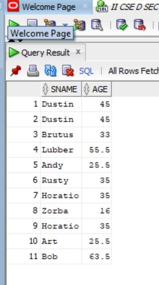
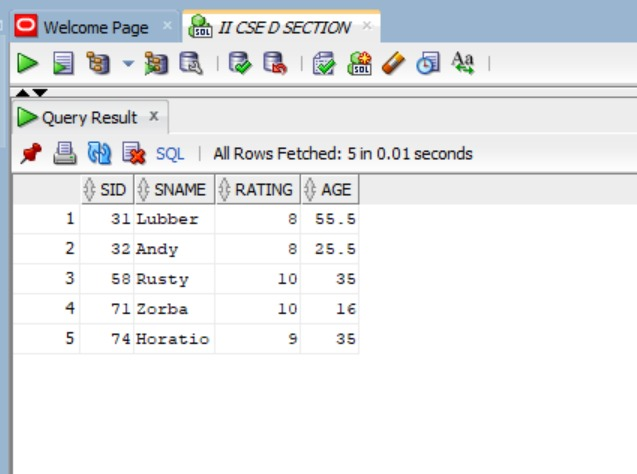
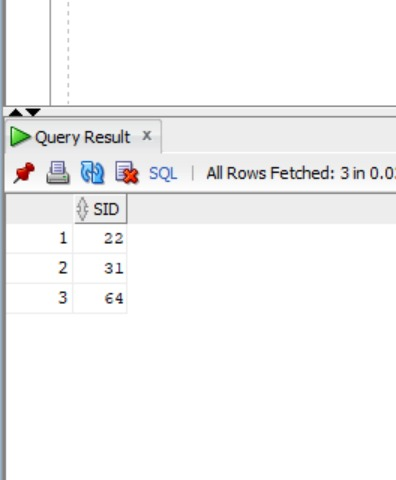
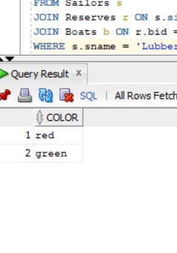
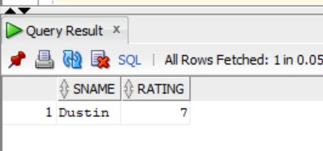
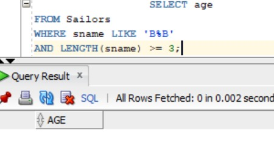
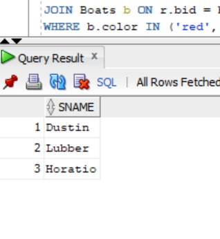
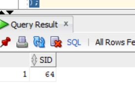

# 2.1. Names and ages of all sailors
```
```
```
SELECT sname, age
FROM Sailors;
```

```
# 2. Sailors with rating above 7
```
```
SELECT *
FROM Sailors
WHERE rating > 7;
```

```
# 3. Names of sailors who reserved boat 103
```
```
SELECT DISTINCT s.sname
FROM Sailors s
JOIN Reserves r ON s.sid = r.sid
WHERE r.bid = 103;
```

```
# 4. SIDs of sailors who reserved a red boat
```
```

SELECT DISTINCT r.sid
FROM Reserves r
JOIN Boats b ON r.bid = b.bid
WHERE b.color = 'red';
```

```
# 5. Names of sailors who reserved a red boat
```
```
SELECT DISTINCT s.sname
FROM Sailors s
JOIN Reserves r ON s.sid = r.sid
JOIN Boats b ON r.bid = b.bid
WHERE b.color = 'red';
```

```
# 6. Colors of boats reserved by Lubber
```
```
SELECT DISTINCT b.color
FROM Sailors s
JOIN Reserves r ON s.sid = r.sid
JOIN Boats b ON r.bid = b.bid
WHERE s.sname = 'Lubber';
```

```
# 7. Names of sailors who reserved at least one boat
```
```
SELECT DISTINCT s.sname
FROM Sailors s
JOIN Reserves r ON s.sid = r.sid;
```

```
# 8. Ratings of persons who sailed two different boats on the same day
```
```
SELECT DISTINCT s.sname, s.rating
FROM Sailors s
JOIN Reserves r1 ON s.sid = r1.sid
JOIN Reserves r2 ON r1.sid = r2.sid
                  AND r1.day = r2.day
                  AND r1.bid <> r2.bid;
```

```
# 9. Ages of sailors whose name begins and ends with B and has at least 3 characters
```
```
SELECT age
FROM Sailors
WHERE sname LIKE 'B%B'
AND LENGTH(sname) >= 3;
```

```
# 10. Names of sailors who reserved a red boat OR a green boat
```
```
SELECT DISTINCT s.sname
FROM Sailors s
JOIN Reserves r ON s.sid = r.sid
JOIN Boats b ON r.bid = b.bid
WHERE b.color IN ('red', 'green');
```

```
# 11. Names of sailors who reserved both red and green boats
```
```
SELECT DISTINCT s.sname
FROM Sailors s
WHERE s.sid IN (
    SELECT r.sid
    FROM Reserves r
    JOIN Boats b ON r.bid = b.bid
    WHERE b.color = 'red'
)
AND s.sid IN (
    SELECT r.sid
    FROM Reserves r
    JOIN Boats b ON r.bid = b.bid
    WHERE b.color = 'green'
);
```

```
# 12. SIDs of sailors who reserved red boats but NOT green boats
```
```
SELECT DISTINCT s.sid
FROM Sailors s
JOIN Reserves r ON s.sid = r.sid
JOIN Boats b ON r.bid = b.bid
WHERE b.color = 'red'
AND s.sid NOT IN (
    SELECT r2.sid
    FROM Reserves r2
    JOIN Boats b2 ON r2.bid = b2.bid
    WHERE b2.color = 'green'
);
```

```
# 13. Ratings of sailors with rating 10 OR who reserved boat 104
```
```
SELECT DISTINCT s.rating
FROM Sailors s
LEFT JOIN Reserves r ON s.sid = r.sid
WHERE s.rating = 10
   OR r.bid = 104;
```

```
# 14. Names of sailors who reserved boat 103
```
```
SELECT DISTINCT s.sname
FROM Sailors s
JOIN Reserves r ON s.sid = r.sid
WHERE r.bid = 103;
```

```
# 15. Names of sailors who reserved a red boat
```
```
SELECT DISTINCT s.sname
FROM Sailors s
JOIN Reserves r ON s.sid = r.sid
JOIN Boats b ON r.bid = b.bid
WHERE b.color = 'red';
```

```
# 16. Names of sailors who reserved boat 103
```
